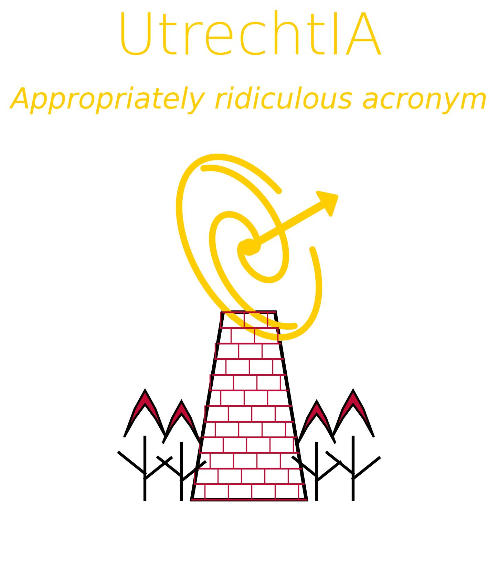

  

**UtrechtIA: echo-IA Workshop**
**31st August - 4th September, 2026 · Utrecth University, Utrecht, NL + Online**

---

## Overview
The UtrechtIA: echo-IA Workshop is the 2026 version of the annual intrinsic alignments meeting that will be held at Utrecht University, the Netherlands this year. It offers a mix of talks and break-out sessions over the week, with an emphasis on making and fostering collabrative efforts.

---

## Location & Format
- **In-person:** Utrecht University, Utrecht, the Netherlands  
- **Virtual:** Remote participation will be supported via Zoom (link shared with registered participants in Slack).  

---

## Quick Links
- [Website](https://echo-ia.github.io/UtrechtIA/)  
- [Schedule](https://echo-ia.github.io/UtrechtIA/pages/schedule.html)  
- [Logistics](https://echo-ia.github.io/CAROLINA/pages/logistics.html)  
- [Participants](https://echo-ia.github.io/CAROLINA/participants/)  
- [Registration](https://echo-ia.github.io/CAROLINA/pages/registration.html)  

---

## Contact
For questions, please reach out to the organizers via Slack or email:  
- **Elisa Chisari** · n.e.chisari@uu.nl 

---

<i>Hope to see you in Utrecht or online!</i>

